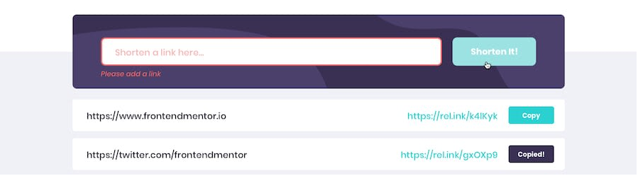

# URL shortening API landing page

URL shortening API is a project that allows you to integrate with the [shrtcode](https://shrtco.de/docs/) API to generate shortened URLs and display them.

## Table of contents

- [Overview](#overview)
  - [Screenshot](#screenshot)
  - [Features](#features)
  - [Links](#links)
- [Built with](#built-with)
- [Author](#author)

## Overview

URL shortening API is an application that converts long url links into short ones.
The entered data is automatically checked for valid urls. Otherwise, a message is displayed about the incorrectly entered url.
The application displays a list of urls and allows you to copy one of them.

### Screenshot

#### Active states:

### Features

Users should be able to:

- View the optimal layout for the site depending on their device's screen size
- Shorten any valid URL
- See a list of their shortened links, even after refreshing the browser
- Copy the shortened link to their clipboard in a single click
- Receive an error message when the `form` is submitted if:
  - The `input` field is empty

### Links

- Solution URL: [on FrontendMentor](https://www.frontendmentor.io/challenges/url-shortening-api-landing-page-2ce3ob-G)
- Live Site URL: [github-Pages Deployment](https://andreykhaylov.github.io/URL-shortening-API/)

## Built with

- Semantic HTML5 markup
- CSS custom properties
- SCSS
- Flexbox
- Mobile-first workflow
- [Typescript](https://www.typescriptlang.org/) - JavaScript with syntax for types
- [React](https://reactjs.org/) - JavaScript library
- [Redux Toolkit](https://redux-toolkit.js.org/) - React state management
- [Framer Motion](https://www.framer.com/motion/) - React Animation library
- [Axios](https://axios-http.com/) - Promise based HTTP client for the browser
- [ESlint](https://eslint.org/) - Find and fix problems in JavaScript code
- [prettier](https://prettier.io/) - Opinionated code formatter

## Author

- github.com - [AndreyKhaylov](https://github.com/AndreyKhaylov)
